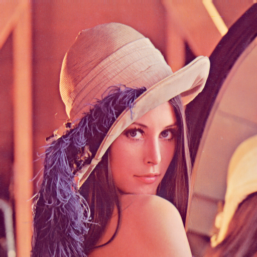

# a prototype OpenCL-like language compiler





Feeding the upper image to the code below and running it as a vulkan compute shader produces the bottom image

Source Code:
```c
kernel [1,1,1]
fn main(input_image: image2d, size: int) -> (output_image: image2d)
{ 
    int2 image_size  = get_image_size(input_image);
    int width = image_size.x;
    int height = image_size.y;

    uint2 coord = [ get_global_id(0), get_global_id(1) ];

    float4 sum  = 0;
    uint  num  = 0;

    int2 shift = 0;

    for (shift.x = -size; shift.x <= size; ++shift.x) {
        for (shift.y = -size; shift.y <= size; ++shift.y) {
            int2 cur = coord + shift;
            if ((0 <= cur.x) && (cur.x < width) && (0 <= cur.y) && (cur.y < height)) {
                ++num;
                sum += read_image(input_image, cur);
            }
        }
    }
    write_image(output_image, coord, sum  / num);
}
```
[Dissambled spirv generated by the compiler](lang.s)